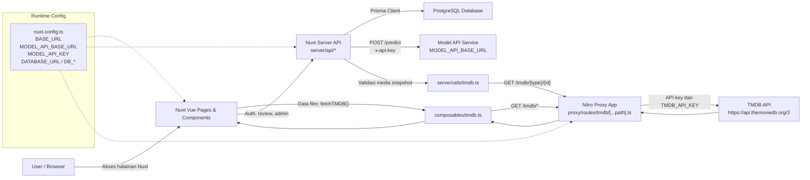
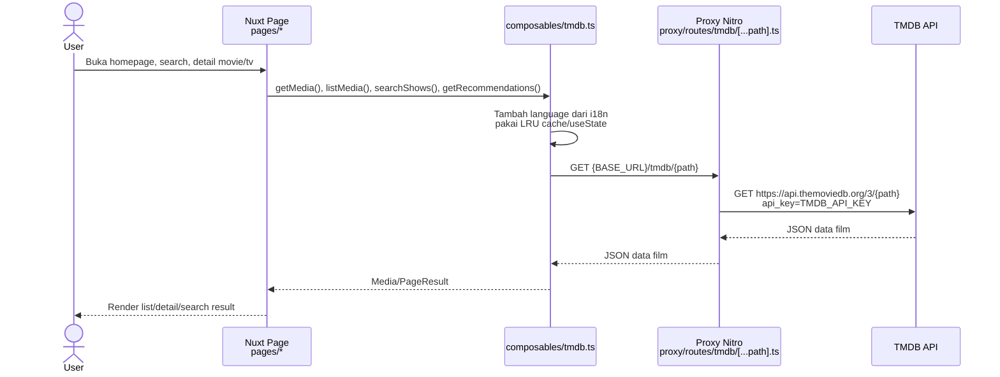
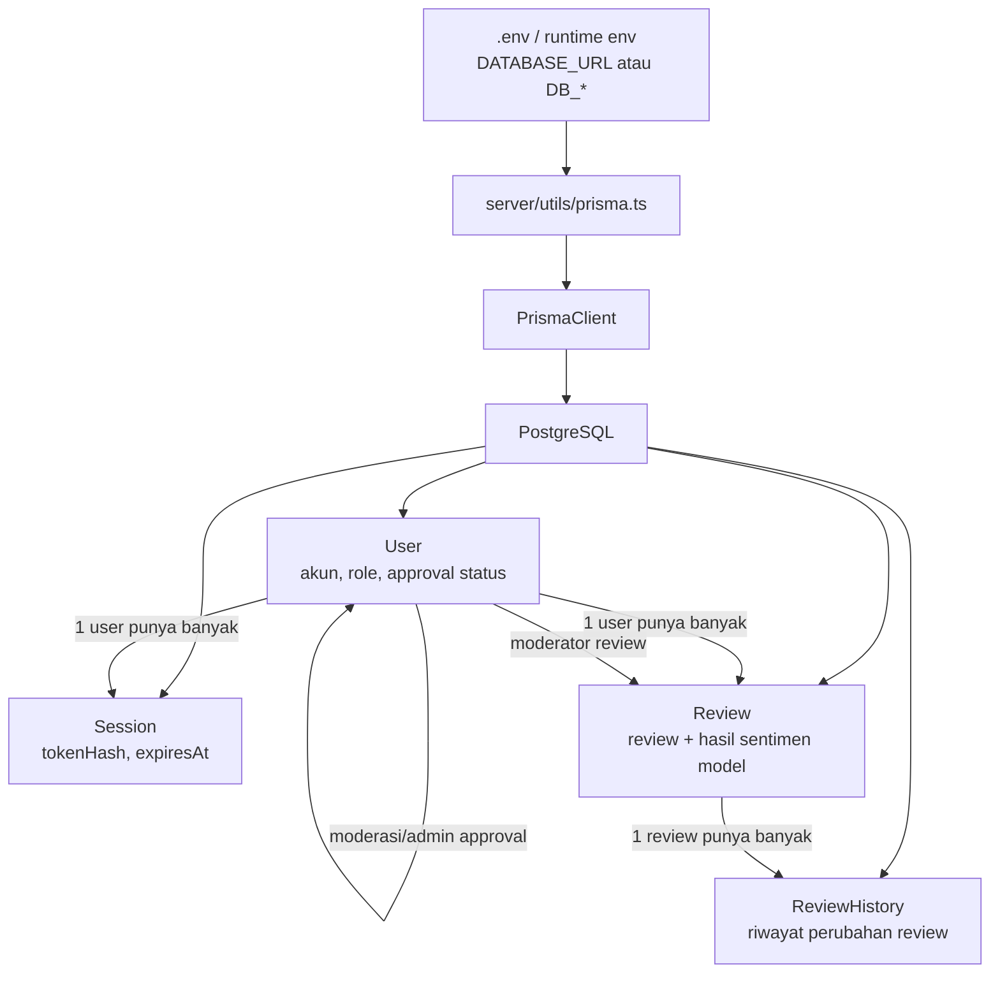
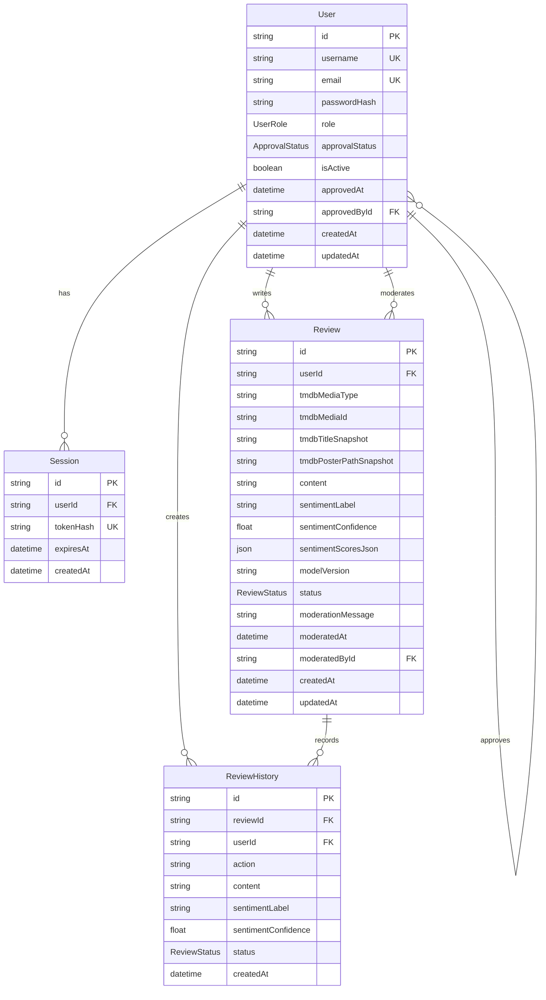
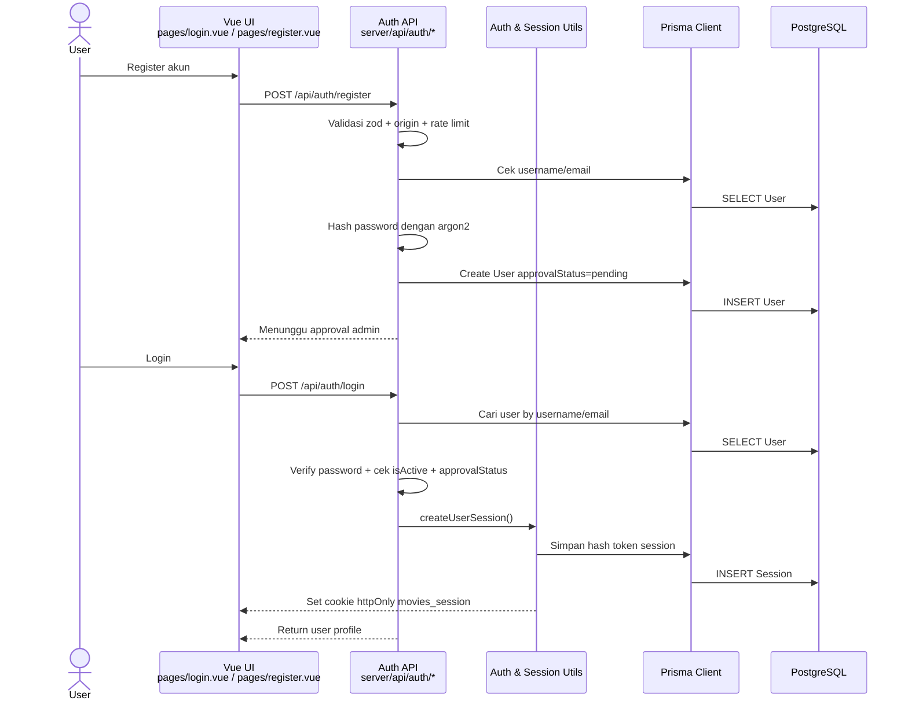
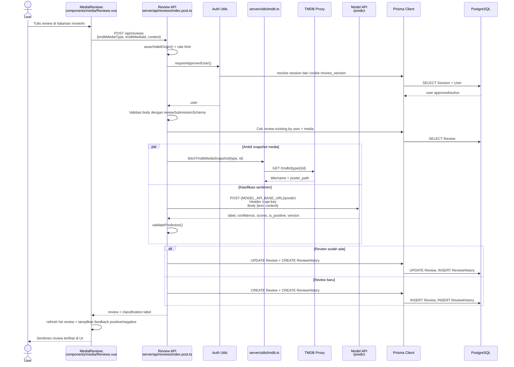
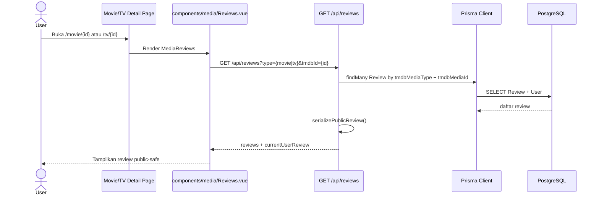
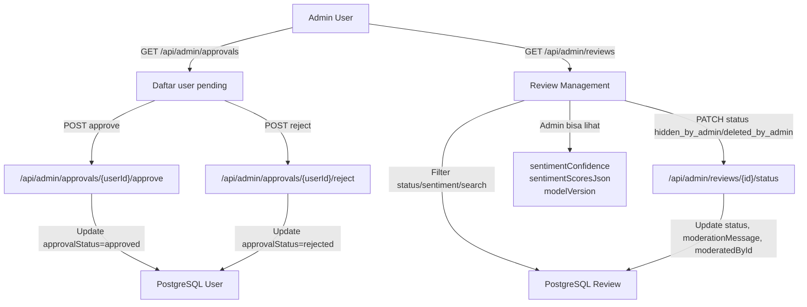
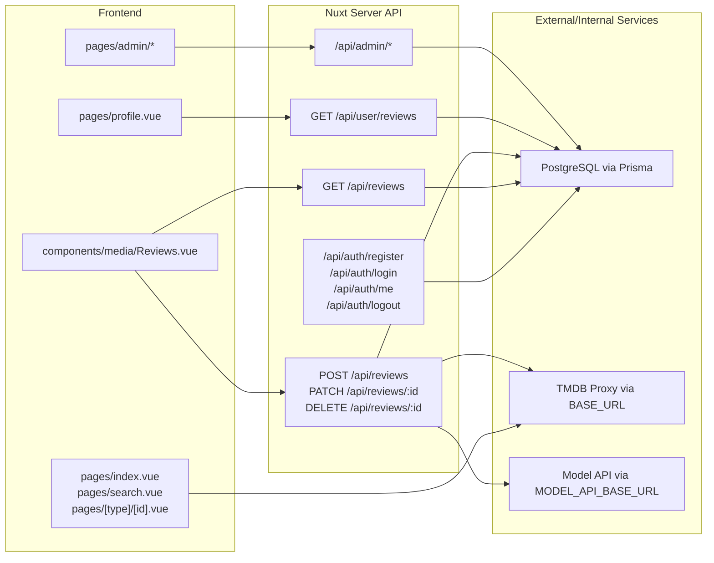

# Diagram Alur Repo Movies Vue

Dokumen ini merangkum alur utama aplikasi berdasarkan struktur kode saat ini. Repo ini adalah aplikasi Nuxt 3/Vue yang mengambil data film dari TMDB melalui proxy, menyimpan akun dan review ke PostgreSQL lewat Prisma, lalu memakai service model eksternal untuk klasifikasi sentimen review.

## 1. Arsitektur Umum



## 2. Sumber Data Film dari TMDB

Data film, TV, genre, person, trending, rekomendasi, dan search tidak disimpan di database aplikasi. Data ini diambil langsung dari TMDB melalui proxy.



Contoh pemanggilan di kode:

- `pages/[type]/[id].vue` memanggil `getMedia(type, id)` dan `getRecommendations(type, id)`.
- `pages/search.vue` memanggil `searchShows(query, page)`.
- `composables/tmdb.ts` mengarah ke `${public.apiBaseUrl}/tmdb`.
- `proxy/routes/tmdb/[...path].ts` meneruskan request ke `https://api.themoviedb.org/3`.

## 3. Database dan Prisma

Database berada di PostgreSQL. Koneksi dibuat oleh Prisma melalui `DATABASE_URL`; jika `DATABASE_URL` tidak ada, `server/utils/prisma.ts` menyusun URL dari `DB_HOST`, `DB_PORT`, `DB_USER`, `DB_PASSWORD`, dan `DB_NAME`.





Catatan penting:

- Database tidak menyimpan detail lengkap film dari TMDB.
- Review menyimpan snapshot minimal film: `tmdbMediaType`, `tmdbMediaId`, `tmdbTitleSnapshot`, dan `tmdbPosterPathSnapshot`.
- Hasil model disimpan di `Review`: `sentimentLabel`, `sentimentConfidence`, `sentimentScoresJson`, dan `modelVersion`.
- Satu user hanya boleh punya satu review per media karena ada unique constraint `userId + tmdbMediaType + tmdbMediaId`.

## 4. Alur Register, Login, Session, dan Akses Database

User tidak pernah berkomunikasi langsung ke database. Browser hanya memanggil endpoint Nuxt server API. Endpoint tersebut membaca/menulis PostgreSQL lewat Prisma.



Endpoint yang butuh user memakai helper:

- `requireUser(event)` untuk user login aktif.
- `requireApprovedUser(event)` untuk user yang sudah disetujui admin.
- `requireAdminUser(event)` untuk endpoint admin.

## 5. Alur User Membuat Review dan Mendapat Klasifikasi Model

Inilah flow utama integrasi user, database, TMDB, dan model.



Payload model yang diharapkan oleh `server/utils/model-api.ts`:

```json
{
  "label": "positive",
  "confidence": 0.9432,
  "scores": {
    "negative": 0.0568,
    "positive": 0.9432
  },
  "is_positive": true,
  "version": "v1"
}
```

Jika model gagal, response tidak valid, atau API key model belum dikonfigurasi, server mengembalikan error dan review tidak disimpan.

## 6. Alur Membaca Review pada Halaman Film



Public-safe berarti:

- Review `visible` menampilkan isi review dan `sentimentLabel`.
- Review `hidden_by_admin` atau `deleted_by_admin` memakai placeholder, tidak membocorkan isi review asli.
- Endpoint public tidak mengirim `sentimentConfidence` dan `sentimentScoresJson`.

## 7. Alur Admin Approval dan Moderasi Review



Admin bisa melihat confidence, skor mentah model, dan versi model. Public/user biasa hanya melihat label sentimen yang sudah diserialisasi aman.

## 8. Ringkasan Endpoint Utama



## 9. File Kode yang Menentukan Flow

- `nuxt.config.ts`: runtime config untuk `BASE_URL`, `MODEL_API_BASE_URL`, `MODEL_API_KEY`.
- `.env.example`: contoh konfigurasi PostgreSQL, proxy, dan model API.
- `proxy/routes/tmdb/[...path].ts`: proxy ke TMDB API.
- `composables/tmdb.ts`: client-side/server-side helper untuk ambil data film.
- `server/utils/prisma.ts`: konstruksi koneksi Prisma ke PostgreSQL.
- `prisma/schema.prisma`: schema `User`, `Session`, `Review`, `ReviewHistory`.
- `server/utils/session.ts`: cookie `movies_session`, hash token, session database.
- `server/utils/auth.ts`: guard user, approved user, dan admin.
- `server/utils/model-api.ts`: integrasi model klasifikasi sentimen.
- `server/utils/tmdb.ts`: validasi snapshot media saat review disimpan.
- `server/api/reviews/*`: create/read/update/delete review dan pemanggilan model.
- `components/media/Reviews.vue`: UI form review dan feedback hasil klasifikasi.
