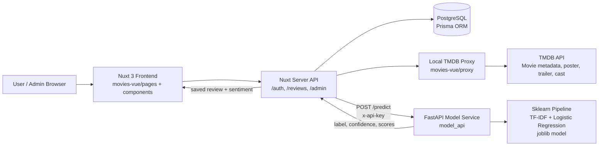
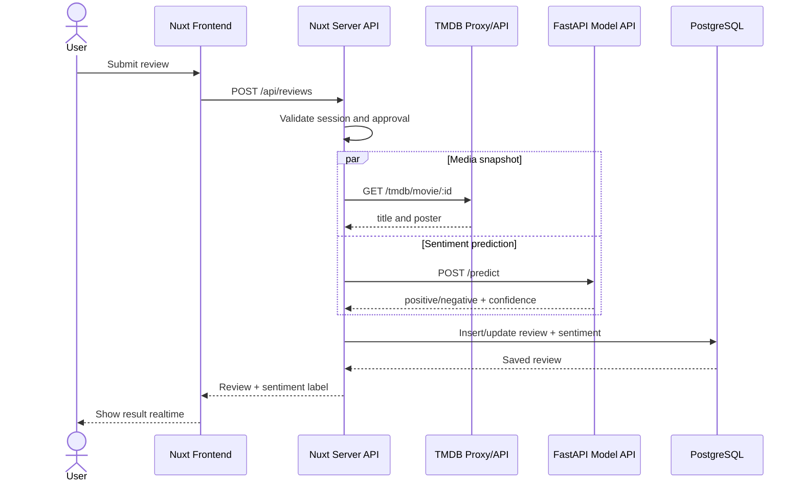
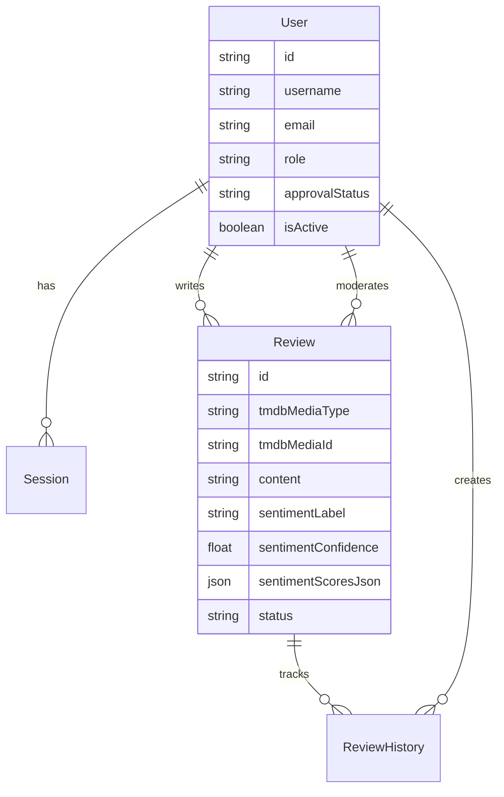

# PRD PPT: Website Review Film dengan NLP Sentiment Classification

## 1. Tujuan Dokumen

Dokumen ini menjadi rancangan isi PPT untuk presentasi tugas besar NLP Implementation. Fokus presentasi adalah menjelaskan produk, metode NLP, arsitektur sistem, integrasi model ke website, hasil evaluasi model, dan alur demo.

Target PPT: 15-18 slide, durasi presentasi sekitar 10-15 menit.

## 1.1 Instruksi untuk AI Agent Pembuat PPT

Jika dokumen ini diberikan ke AI agent untuk membuat PPT, ikuti aturan berikut:

- Buat PPT berbahasa Indonesia, kecuali istilah teknis umum seperti `sentiment analysis`, `pipeline`, `endpoint`, `confidence`, dan nama teknologi.
- Gunakan struktur slide pada bagian "Rancangan Slide PPT" sebagai sumber utama.
- Jangan menambah fitur yang tidak ada di repo.
- Jangan mengubah metrik model.
- Jangan mengklaim model mendukung Bahasa Indonesia; model saat ini dilatih dari dataset IMDB berbahasa Inggris.
- Gunakan Mermaid diagram yang tersedia untuk membuat gambar arsitektur dan sequence flow.
- Jika screenshot aplikasi belum tersedia, buat placeholder jelas seperti `[Screenshot detail film]`, bukan gambar palsu.
- Untuk setiap slide, isi maksimal 4-6 bullet agar tidak terlalu padat.
- Gunakan speaker notes singkat 2-4 kalimat per slide agar presenter mudah menjelaskan.
- Pertahankan narasi bahwa inti proyek adalah integrasi NLP realtime ke website review film.

Output yang diharapkan dari AI agent:

1. File PPT/PPTX.
2. Gambar arsitektur dari Mermaid.
3. Gambar sequence flow dari Mermaid.
4. Speaker notes per slide.
5. Daftar screenshot yang perlu diambil manual dari aplikasi.

## 2. Ringkasan Proyek

Proyek ini adalah website review film yang mengambil data film dari TMDB API, menyediakan autentikasi admin dan user, memungkinkan user menulis review, lalu mengklasifikasikan sentimen review secara realtime menggunakan model NLP binary classification.

Komponen utama:

- `imdb_sentiment_api_ready.ipynb`: notebook training dan evaluasi model sentimen dari `IMDB Dataset.csv`.
- `model_api/`: FastAPI service untuk menyajikan model sentimen lewat endpoint API.
- `movies-vue/`: aplikasi Nuxt/Vue untuk daftar film, detail film, autentikasi, review user, admin dashboard, dan integrasi model.

## 3. Kesesuaian dengan Soal

| Requirement tugas | Implementasi di proyek |
| --- | --- |
| Website review film sederhana | `movies-vue/` berbasis Nuxt 3 dan Vue 3 |
| Trailer/poster film | Data film, poster, video/trailer dari TMDB API |
| Sinopsis film | Detail film dari TMDB API |
| Casting/actor film | Halaman detail media dan komponen person/cast |
| Rating | Rating dari data TMDB dan komponen rating |
| Teks review dan sentimen | Form review user, hasil `positive` / `negative` dari model NLP |
| Minimal 5 film random dari bank 30 film | Bisa dijelaskan sebagai daftar film dari TMDB, disaring atau diambil acak pada halaman list |
| User bisa review semua film yang ditampilkan | Review dapat dibuat pada detail movie/TV oleh user approved |
| NLP realtime | Submit review memanggil `model_api` melalui Nuxt server API |
| Deliverable source code | Notebook, FastAPI, dan Nuxt app tersedia dalam repo |
| Deliverable model | `model_api/models/imdb_sentiment_pipeline.joblib` |

## 4. Narasi Utama Presentasi

Narasi yang disarankan:

1. Masalah: review film banyak berupa teks bebas, sehingga sulit dirangkum cepat.
2. Solusi: website review film yang otomatis memberi label sentimen dari review user.
3. Data: model dilatih dari 50.000 review IMDB yang seimbang antara positive dan negative.
4. Metode: text cleaning, TF-IDF, benchmark beberapa model, lalu deployment Logistic Regression.
5. Integrasi: model diekspor sebagai `joblib`, disajikan oleh FastAPI, lalu dipanggil dari backend Nuxt saat user submit review.
6. Hasil: model mencapai accuracy 90.3 persen dan macro F1 sekitar 0.903.
7. Demo: user login, buka film, submit review, sentimen muncul realtime, admin dapat melihat dan moderasi review.

## 5. Rancangan Slide PPT

### Slide 1 - Judul

Judul:

`Movie Review Website with NLP Sentiment Classification`

Isi:

- Nama anggota kelompok
- Mata kuliah / kelas
- Tanggal presentasi
- Screenshot halaman utama atau detail film sebagai background

Catatan pembahasan:

- Perkenalkan bahwa proyek ini menggabungkan web app, API model, dan NLP classification.

### Slide 2 - Latar Belakang

Isi:

- Review film berbentuk teks bebas.
- User lain butuh ringkasan cepat apakah review cenderung positif atau negatif.
- Sentiment analysis dapat membantu membaca opini user secara otomatis.

Visual:

- Ilustrasi alur: review text -> NLP model -> sentiment label.

### Slide 3 - Tujuan Proyek

Isi:

- Membangun website review film dengan data dari TMDB.
- Menyediakan fitur review untuk user.
- Mengintegrasikan model NLP agar setiap review diklasifikasi realtime.
- Menyediakan role admin dan user untuk manajemen review dan akun.

### Slide 4 - Fitur Utama Website

Isi:

- Browse movie/TV dari TMDB.
- Detail film: poster, sinopsis, cast, rating, trailer/video.
- Register, login, profile.
- User review dan edit review.
- Admin approval user dan moderasi review.
- Sentiment result pada review.

Visual:

- Screenshot halaman list film, detail film, form review, dan admin.

### Slide 5 - Dataset

Isi:

- Dataset: `IMDB Dataset.csv`.
- Jumlah data: 50.000 review.
- Label: `positive` dan `negative`.
- Distribusi label: 25.000 positive, 25.000 negative.
- Split: 80 persen train dan 20 persen test.
- Test set: 10.000 review.

Catatan:

- Tekankan dataset seimbang, sehingga accuracy lebih mudah dibaca sebagai metrik utama.

### Slide 6 - Preprocessing Teks

Isi:

- HTML unescape.
- Menghapus tag HTML seperti `<br />`.
- Normalisasi whitespace.
- Lowercase, strip accents, stop words English di TF-IDF.
- TF-IDF menggunakan unigram dan bigram.

Contoh:

```text
Raw review  : A wonderful movie.<br /><br />I loved it!
Clean review: A wonderful movie. I loved it!
```

### Slide 7 - Eksperimen Model

Isi:

Model yang dibandingkan:

| Model | Accuracy | F1 positive |
| --- | ---: | ---: |
| Linear SVC | 0.9123 | 0.912901 |
| Logistic Regression | 0.9030 | 0.904017 |
| Multinomial NB | 0.8864 | 0.886468 |

Catatan pembahasan:

- Linear SVC memiliki accuracy tertinggi.
- Logistic Regression dipilih untuk deployment karena mendukung `predict_proba`, sehingga API dapat mengembalikan confidence dan score per label.

### Slide 8 - Model Final

Isi:

- Pipeline: `TfidfVectorizer` + `LogisticRegression`.
- Model file: `imdb_sentiment_pipeline.joblib`.
- Model name: `tfidf_logistic_regression`.
- Accuracy: 0.903.
- Macro F1: 0.902989.
- Weighted F1: 0.902989.

Visual:

- Confusion matrix dari notebook.
- Ringkasan classification report.

### Slide 9 - Arsitektur Sistem

Isi:

- Frontend dan backend aplikasi ada di Nuxt.
- TMDB proxy mengambil data film dari TMDB API.
- Nuxt server memanggil FastAPI model service.
- PostgreSQL menyimpan user, session, review, sentiment score, dan history review.

Mermaid:



### Slide 10 - Alur Submit Review Realtime

Isi:

1. User login dan membuka detail film.
2. User menulis review.
3. Nuxt server memvalidasi session, role, approval, dan isi review.
4. Server mengambil snapshot judul/poster dari TMDB.
5. Server mengirim teks review ke FastAPI `/predict`.
6. FastAPI mengembalikan label, confidence, dan scores.
7. Review dan hasil sentimen disimpan ke PostgreSQL.
8. UI menampilkan review dan label sentimen tanpa reload halaman.

Mermaid:



### Slide 11 - API Model Sentiment

Isi:

Endpoint utama:

```http
POST /predict
x-api-key: <API_KEY>
Content-Type: application/json
```

Request:

```json
{
  "text": "This movie was surprisingly heartfelt and beautifully acted."
}
```

Response:

```json
{
  "label": "positive",
  "confidence": 0.9432,
  "scores": {
    "negative": 0.0568,
    "positive": 0.9432
  },
  "is_positive": true
}
```

Catatan:

- Browser tidak langsung memanggil FastAPI.
- API key hanya disimpan di server Nuxt.
- Ini lebih aman dibanding mengekspos API key di frontend.

### Slide 12 - Data Model Database

Isi:

Entitas utama:

- `User`: akun, role admin/user, approval status, active status.
- `Session`: token login berbasis HTTP-only cookie.
- `Review`: review user, media TMDB, label sentimen, confidence, score JSON, status moderasi.
- `ReviewHistory`: riwayat perubahan review.

Mermaid:



### Slide 13 - Role dan Keamanan

Isi:

- Guest dapat browse film dan melihat review.
- User harus register dan menunggu approval admin.
- Approved user dapat membuat, mengedit, dan menghapus review sendiri.
- Admin dapat approve/reject user, menonaktifkan user, dan moderasi review.
- Session memakai HTTP-only cookie.
- Password di-hash dengan Argon2.
- Mutating API route memvalidasi origin.
- Review submission memiliki rate limit.

### Slide 14 - Implementasi Integrasi di `movies-vue`

Isi:

File penting:

- `server/api/reviews/index.post.ts`: menerima submit review, validasi, klasifikasi, simpan ke DB.
- `server/utils/model-api.ts`: wrapper pemanggilan FastAPI `/predict`.
- `server/utils/tmdb.ts`: mengambil snapshot media dari TMDB.
- `server/utils/auth.ts`: validasi user, approved user, dan admin.
- `components/media/Reviews.vue`: UI review di detail film.
- `pages/admin/*.vue`: admin dashboard, approvals, reviews, users.

Catatan pembahasan:

- Bagian terpenting adalah review tidak disimpan jika model API gagal, sehingga semua review yang tersimpan punya hasil klasifikasi.

### Slide 15 - Demo Flow

Urutan demo:

1. Jalankan `model_api` di port 8000.
2. Jalankan TMDB proxy di port 3001.
3. Jalankan `movies-vue` di port 3000.
4. Buka homepage dan pilih film.
5. Tunjukkan poster, sinopsis, cast, rating, trailer.
6. Login sebagai user.
7. Submit review positif dan tunjukkan label positif.
8. Edit menjadi review negatif dan tunjukkan label berubah.
9. Login sebagai admin.
10. Tunjukkan approval user dan moderasi review.

### Slide 16 - Hasil dan Evaluasi

Isi:

- Model dapat mengklasifikasikan review menjadi positive atau negative.
- Accuracy test: 90.3 persen.
- Macro F1: 0.902989.
- Integrasi realtime berhasil melalui endpoint FastAPI.
- Hasil klasifikasi disimpan bersama review untuk audit dan tampilan admin.

Visual:

- Tabel metrik.
- Screenshot response API.
- Screenshot hasil review di UI.

### Slide 17 - Kendala dan Solusi

Isi:

| Kendala | Solusi |
| --- | --- |
| Review user berupa teks bebas | Validasi panjang teks 10-2000 karakter |
| Model perlu dipakai oleh website | Model diekspor `joblib` dan disajikan lewat FastAPI |
| API key model tidak boleh bocor | Pemanggilan model dilakukan dari Nuxt server |
| Data film tidak ingin disimpan manual | Menggunakan TMDB API sebagai sumber data film |
| Review perlu bisa dimoderasi | Admin dashboard dan status review |

### Slide 18 - Kesimpulan dan Pengembangan

Isi:

Kesimpulan:

- Sistem memenuhi kebutuhan website review film dan NLP sentiment analysis.
- Model TF-IDF + Logistic Regression cukup kuat untuk baseline dengan accuracy 90.3 persen.
- Arsitektur dipisah menjadi web app, model API, database, dan TMDB proxy.

Pengembangan:

- Tambah dukungan Bahasa Indonesia atau multilingual sentiment model.
- Tambah batch analytics untuk statistik sentimen per film.
- Tambah rekomendasi film berdasarkan review dan genre.
- Deploy ke cloud dengan model API private.

## 6. Rekomendasi Visual PPT

Gunakan gaya visual yang konsisten dengan tema film:

- Background gelap/cinematic.
- Aksen warna kuning/emas untuk rating dan positive sentiment.
- Aksen biru/abu untuk negative sentiment.
- Gunakan screenshot nyata dari aplikasi lebih banyak daripada ilustrasi generik.
- Gunakan 1 diagram besar untuk arsitektur dan 1 sequence diagram untuk alur review.

Asset yang sebaiknya disiapkan:

- Screenshot homepage/list film.
- Screenshot detail film.
- Screenshot form review sebelum submit.
- Screenshot review setelah sentimen muncul.
- Screenshot admin approvals.
- Screenshot admin reviews.
- Screenshot notebook metrik atau confusion matrix.
- Screenshot FastAPI docs atau response `/predict`.

## 7. Struktur File yang Bisa Disebut di PPT

```text
TA/
├── imdb_sentiment_api_ready.ipynb
├── artifacts/
│   ├── imdb_sentiment_metrics.json
│   └── imdb_sentiment_pipeline.joblib
├── model_api/
│   ├── app/main.py
│   ├── sentiment_utils.py
│   └── models/
│       ├── imdb_sentiment_metrics.json
│       └── imdb_sentiment_pipeline.joblib
└── movies-vue/
    ├── pages/
    ├── components/
    ├── server/api/
    ├── server/utils/
    └── prisma/schema.prisma
```

## 8. Pembagian Pembahasan Anggota Kelompok

Jika presentasi dilakukan oleh 3-4 orang:

### Anggota 1 - Produk dan Website

- Latar belakang.
- Tujuan proyek.
- Fitur website.
- Demo browse film dan detail film.

### Anggota 2 - NLP dan Model

- Dataset IMDB.
- Preprocessing.
- Benchmark model.
- Evaluasi dan alasan pemilihan Logistic Regression.

### Anggota 3 - Backend dan Integrasi

- FastAPI model service.
- Endpoint `/predict`.
- Nuxt server API.
- Database dan Prisma schema.
- Keamanan API key.

### Anggota 4 - Demo dan Kesimpulan

- Demo submit review realtime.
- Demo admin moderation.
- Kendala dan solusi.
- Kesimpulan dan rencana pengembangan.

## 9. Catatan Penting untuk Presentasi

- Jelaskan bahwa model yang dipakai untuk deployment bukan sekadar notebook, tetapi sudah menjadi service API yang dipakai website.
- Tekankan alur realtime: review user langsung dikirim ke model, hasilnya langsung ditampilkan dan disimpan.
- Jelaskan alasan pemilihan Logistic Regression walaupun Linear SVC lebih tinggi: kebutuhan confidence score dari `predict_proba`.
- Hindari terlalu banyak membahas kode per baris. Fokus pada alur sistem, keputusan teknis, dan hasil.
- Saat demo, gunakan contoh review yang jelas positif atau negatif agar hasil model mudah dipahami audiens.

## 10. Contoh Script Singkat Presentasi

Pembuka:

> Proyek kami adalah website review film yang tidak hanya menampilkan data film dari TMDB, tetapi juga menganalisis sentimen review user secara realtime menggunakan model NLP.

Bagian model:

> Dataset yang digunakan adalah IMDB Dataset berisi 50.000 review dengan distribusi seimbang. Setelah preprocessing, teks diubah menjadi fitur TF-IDF, lalu kami membandingkan beberapa model. Untuk deployment kami memilih Logistic Regression karena selain akurasinya tinggi, model ini dapat memberikan confidence score.

Bagian integrasi:

> Ketika user submit review, browser tidak langsung memanggil model. Request masuk ke Nuxt server, divalidasi, lalu server memanggil FastAPI model dengan API key. Hasil sentimen disimpan bersama review di PostgreSQL.

Penutup:

> Dengan arsitektur ini, proyek memenuhi requirement tugas: website review film, data film lengkap dari TMDB, review user, serta implementasi NLP yang bekerja realtime pada review yang masuk.

## 11. Checklist PPT Final

Sebelum PPT dianggap selesai, pastikan item berikut terpenuhi:

- Slide judul mencantumkan nama proyek dan anggota kelompok.
- Ada slide yang memetakan requirement tugas ke implementasi proyek.
- Ada slide dataset yang menyebut 50.000 review, 25.000 positive, 25.000 negative.
- Ada slide preprocessing yang menjelaskan HTML cleaning dan TF-IDF.
- Ada slide eksperimen model yang membandingkan Multinomial NB, Logistic Regression, dan Linear SVC.
- Ada slide yang menjelaskan alasan Logistic Regression dipilih untuk deployment.
- Ada slide evaluasi dengan accuracy 0.903 dan macro F1 0.902989.
- Ada diagram arsitektur sistem.
- Ada sequence diagram alur submit review realtime.
- Ada slide API model dengan contoh request dan response.
- Ada slide database atau data model.
- Ada slide role admin/user dan keamanan dasar.
- Ada slide demo flow yang mudah diikuti saat presentasi.
- Ada slide kendala dan solusi.
- Ada slide kesimpulan dan pengembangan.

## 12. Risiko yang Perlu Diperjelas Saat Presentasi

Ada beberapa hal yang sebaiknya dijelaskan secara jujur agar presentasi tetap kuat:

- Model dilatih dari review IMDB berbahasa Inggris, sehingga performa terbaiknya untuk review Bahasa Inggris.
- Jika demo memakai review Bahasa Indonesia, hasil sentimen bisa kurang konsisten kecuali model dilatih ulang atau diterjemahkan lebih dulu.
- Requirement "bank 30 film random" perlu dipastikan pada implementasi. Jika saat ini data diambil langsung dari TMDB, siapkan daftar 30 ID film TMDB lalu tampilkan random minimal 5 dari daftar itu.
- Confidence score tidak ditampilkan ke user biasa, tetapi disimpan dan dapat dilihat di sisi admin.
- FastAPI model service sebaiknya tetap private; browser hanya berkomunikasi dengan Nuxt server.
